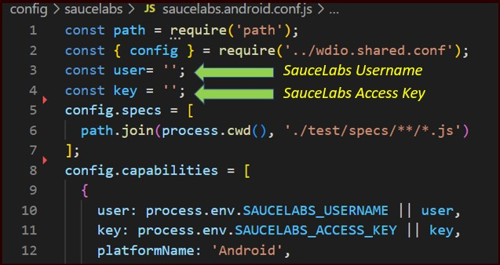
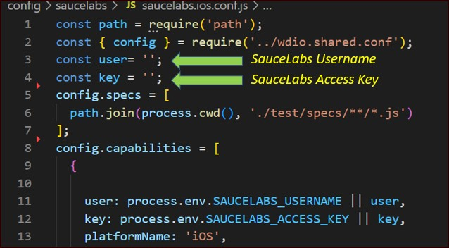
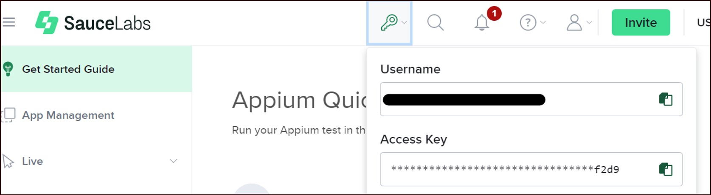
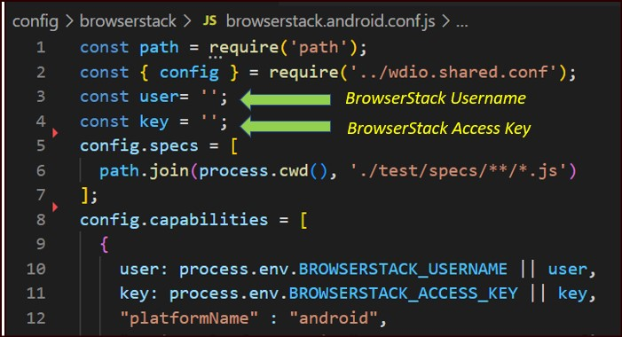
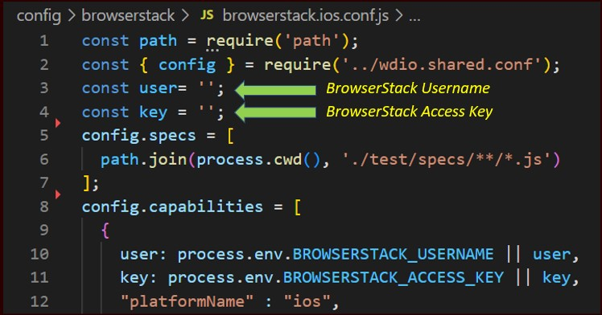
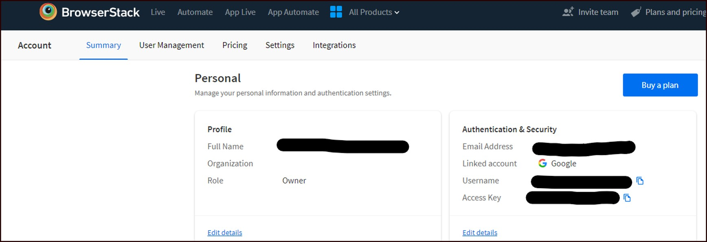
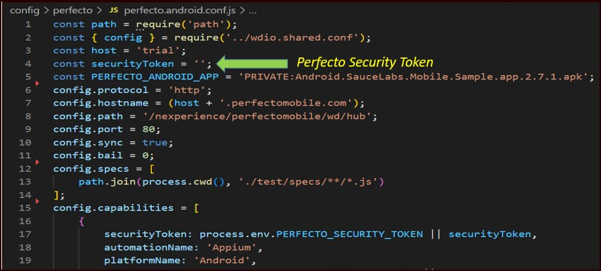
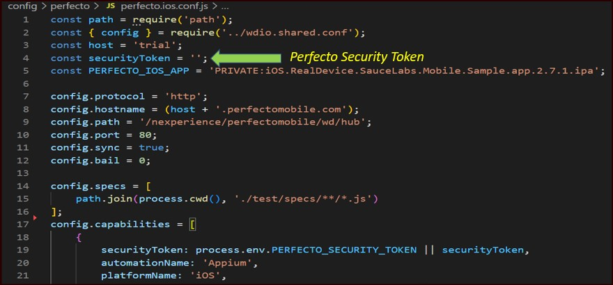
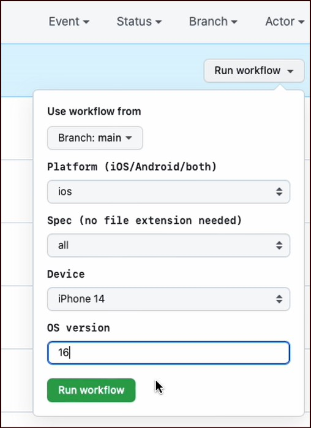
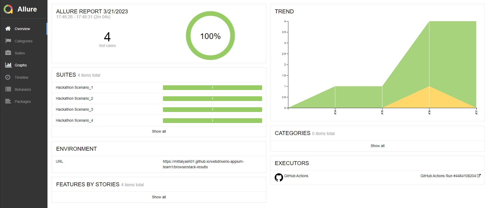

# Mobile Hackathon: Introduction
This repository is setup as a part of Mobile Test automation hackathon to demonstrate the capabilities of [WebDriverIO](https://webdriver.io/) test automation framework. The team has setup WebDriverIO for mobile native app test automation with libraries/tools such as- [mocha](https://mochajs.org/) framework, [Appium](https://appium.io) for mobile automation, [Allure Reporter](https://webdriver.io/docs/allure-reporter/) for robust reporting. We also demonstrated and compared the capabilities of integrating this framework with cloud execution environments such as- [BrowserStack](https://www.browserstack.com/), [Saucelabs](https://saucelabs.com/), [Perfecto](https://www.perfecto.io/) and [AWS Device Farm](https://aws.amazon.com/device-farm/).

## Table of contents
1. [Getting Started](#getting-started)
    1. [Pre-requisites](#Pre-requisites)
    1. [Supported testing types and platforms](#Supported-testing-types-and-platforms)
    1. [Installation](#Installation)
        1. [Use with Android](#use-with-android)
        1. [Use with iOS](#use-with-ios)
    1. [How to use](#how-to-use)
    1. [Integrations](#Integrations)
        1. [Saucelabs](#Saucelabs)
            1. [Positive Outlook](#Positive-outlook)
            1. [Shortcomings](#Shortcomings)
        1. [BrowserStack](#BrowserStack)
            1. [Positive Outlook](#Positive-outlook)
            1. [Shortcomings](#Shortcomings)
        1. [Perfecto](#Perfecto)
            1. [Positive Outlook](#Positive-outlook)
            1. [Shortcomings](#Shortcomings)
        1. [AWS Device Farm](#aws-device-farm)
            1. [Positive Outlook](#Positive-outlook)
            1. [Shortcomings](#Shortcomings)
1. [Executing your first test](#executing-your-first-test)
        1. [Execute on user local](#Execute-on-user-local)
        1. [Execute over CI](#Execute-in-CI)
1. [Overall Summary](#overall-summary)
1. [Metrics](#Metrics)
1. [Cloud Service Providers list](#cloud-service-providers)
 
 ------------------------------------------------------------------------

## Getting Started
Once the pre-requisites steps are complete for setting up the framework and cloud provider execution environment setup, users can clone the repo and run the mentioned comments under each sections.

### Pre-requisites
The user must need below software installed in their machine for framework setup:

* [Node JS](https://nodejs.org/en/download/) - Should be V16.x or higher version
* Java (either from [Oracle](https://www.oracle.com/ca-en/java/technologies/downloads/) or [Open JDK](https://adoptium.net/)) - Version 8 or later
* [Appium Inspector](https://github.com/appium/appium-inspector/releases)

Optional: [Android Studio](https://developer.android.com/studio)  (to execute tests using emulator)
    
Your machine should have below minimum configurations:

* OS: Windows 10 (or later version) or MacOS 10.7 (or later version)
* Processor: Intel i5 or later version 
* Memory: 8 GB RAM
* Hard Disk: 10 GB free space

### Supported testing types and platforms
- [x] Mobile app on Android
- [x] Mobile app on iOS
- [ ] Web app on Android
- [ ] Web app on iOS

### Installation and Local setup
Clone the repository and install the below required packages and drivers through Node JS

- **Install WebDriverIO**: `npm install @wdio/cli`
- **Install latest Appium (2.0 version)**: `npm install -g appium@next`
- **Install latest Appium Doctor**: `npm i -g appium-doctor`
- **Install driver for Android**: `appium driver install uiautomator2`
- **Install driver for iOS**: `appium driver install XCUI Test`
- **To start Appium server**: `appium -p <portID_given_in_appium_inspector>`
--------------------------------------------------------------------------------------------------

#### Use with Android
The target android application's apk is available in [app](https://github.com/mittalyash01/webdriverio-appium-team1/tree/main/app/android). This apk should be uploaded to the required Cloud automation framework provider website (after creating necessary user profiles)

#### Use with iOS
The target iOS application's apk is available in [app](https://github.com/mittalyash01/webdriverio-appium-team1/tree/main/app/ios). This apk should be uploaded to the required Cloud automation framework provider website (after creating necessary user profiles).

### How to Use
The below steps should be followed to use this framework:
- [Clone](https://docs.github.com/en/repositories/creating-and-managing-repositories/cloning-a-repository) this repository OR
- [Download](https://www.gitkraken.com/learn/git/github-download) the project as zip

### Integrations
In this section we will elaborate the integration of the automation framework with various cloud execution environment/ device farm. We will showcase the capability of each combination as in-depth analysis of what went well and not, how we navigate through challenges and share some key metrics around each combination.

#### SauceLabs

[SauceLabs](https://www.saucelabs.com/) is a cloud-hosted web and mobile application automated testing platform. It provides a wide range of comprehensive test infrastructure for automated and manual testing of mobile applications using Selenium, Appium and JavaScript unit testing frameworks.

To install wdio saucelabs service run the command:
`npm install wdio-sauce-service --save-dev`

To execute test in SauceLabs, below configuration files can be accessed from [here](https://github.com/mittalyash01/webdriverio-appium-team1/tree/main/config/saucelabs) and username and Access key should be updated with SauceLabs credentials.
    
For Android:
    
<a href="https://www.browserstack.com/">
    
For iOS:
    
<a href="https://www.browserstack.com/">

To get Access key
    
<a href="https://www.browserstack.com/">
    
##### Positive outlook 
1. Easy to integrate
2. Trial version supports 160 mins of free usage on max of 2 real devices in parallel
3. Able to use the same script for both Android and iOS testing
4. Good documentation from the vendor on tool integration
    
##### Shortcoming 
1. Limited collection of Real Devices availability
    
    
-------------------------------------------------------------------------------------------------------------------------------

#### BrowserStack 

[BrowserStack](https://www.browserstack.com/app-live) is a cloud web and mobile testing platform which offers the ability to test websites and mobile applications across on-demand browsers and real mobile devices. The list of supoorted devices and OS versions for Automation are listed [here](https://www.browserstack.com/list-of-browsers-and-platforms/app_automate)

To install wdio browserstack service run the command:
`npm install @wdio/browserstack-service --save-dev`

As next step, below configuration files can be accessed from [here](https://github.com/mittalyash01/webdriverio-appium-team1/tree/main/config/browserstack) and username and Access key should be updated:

For Android:

<a href="https://www.browserstack.com/">

For iOS:

<a href="https://www.browserstack.com/">

Note: *BROWSERSTACK_USERNAME and BROWSERSTACK_ACCESS_KEY are stored in environment variables and these can be obtained from browserstack's website for each registered users.*
    
<a href="https://www.browserstack.com/">

##### Positive outlook
1. Easy to integrate
2. Comparatively it has large collection of Real devices
3. Trial version supports 100 mins of free usage on wide range of  devices
4. Detailed reporting
5. Able to use the same script for both Android and iOS testing
6. Good documentation from the vendor on tool integration
 
##### Shortcoming 
NONE

--------------------------------------------------------------------------------------

#### Perfecto

[Perfecto](https://www.perfecto.io/) is a cloud-based continuous automated testing platform for enterprise mobile and web apps. It features more than 3,000 devices in the cloud which provides the capacity to test for web, mobile and IoT with a single script.

To install wdio perfecto service run the command: 
`npm install wdio-perfecto-service --save-dev`

To execute test in Perfecto, below configuration files can be accessed from [here](https://github.com/mittalyash01/webdriverio-appium-team1/tree/main/config/perfecto) and host name and Security Token should be updated with Perfecto credentials.

    
For Android
    
 <a href="https://www.browserstack.com/">

For iOS:
    
<a href="https://www.browserstack.com/">
    

To get Security Token:
 [image should be uploaded]

##### Positive outlook
    
1. Good documentation from the vendor on tool integration
2. Easy to integrate
3. Trial version supports 14 days of free usage on a range of Android and iOS with parallel run on 2 real devices
4. Able to use the same script for both Android and iOS testing with minor tweaks
 
##### Shortcoming 
    
1. High execution turnaround time. 3-5 x as compared to other solutions
2. Takes very long to open a tunnel connection (~ 30 seconds)
3. Doesn’t support latest version of WebDriver IO 8
4. Need to set high timeout to prevent failing
5. Need to check device availability every time before executing tests- since these were shared/public devices over the cloud. 
6. The device management console is not present, could be better from usability point of view.
    
------------------------------------------------------------------------------------------------------------------------------------------    

#### AWS Device Farm
AWS Device Farm is an application testing service that lets you improve the quality of your web and mobile apps by testing them across an extensive range of desktop browsers and real mobile devices; without having to provision and manage any testing infrastructure. The service enables you to run your tests concurrently on multiple desktop browsers or real devices to speed up the execution of your test suite, and generates videos and logs to help you quickly identify issues with your app.

Unfortunately, AWS device farm currently doesn't support WebDriverIo native app executions. It supports only desktop broswer testing. Please refer to [docs](https://webdriver.io/docs/wdio-aws-device-farm-service/)
    
##### Positive outlook 

Not Applicable. We will update this section if this service is available in the future.
    
##### Shortcoming 
    
1. Need to upload the entire framework in zip format, there is no provision of tunnel execution through local or CI.
2. Very less documentation, support available.
3. Not a user friendly solution, could have done better.

## Executing your first test
### Execute on user local: 
 To execute test using this framework in your local machine, use following command:
    `npx wdio {config} --spec {filename}`
 
where:
- {config} refers to the [scripts](https://github.com/mittalyash01/webdriverio-appium-team1/tree/main/package.json)
- {filename} refers to the specific [test](https://github.com/mittalyash01/webdriverio-appium-team1/tree/main/test/specs). In case you wish to execute all tests under spec folder, please ignore this parameter.

### Execute over CI: 
 To execute test using CI (we use GitHub here). Follow below steps:
 - Push the framework code to the CI tool of your preference.
 - Set secrets/environment variables as mentioned in [configs](https://github.com/mittalyash01/webdriverio-appium-team1/tree/main/config) for each cloud vendor in use.
 - Navigate to Actions tab (if the tool supports gh-actions) and select the respective CI you wish to execute.
 - Provide appropriate parameters, click Run Workflow and voila!
 
 <a href="https://www.browserstack.com/">
 
 - Check test results in gh-pages [repository](https://github.com/mittalyash01/webdriverio-appium-team1/tree/gh-pages/browserstack-results)
and [Allure report](https://mittalyash01.github.io/webdriverio-appium-team1/browserstack-results/34/)

 

## Overall Summary
Overall WebDriverIO is a stable solution for native mobile application testing. User must have basic JavaScript and npm knowledge to work on this framework.

## Metrics
Below are few key metrics which we catured during our analysis on each tool combination:
     
     
| Test Automation tool stack | Device Farm | Abrupt Connection Loss/ Latencies (Device connection aren't reliable, abruptly the connections are lost during execution (Score out of 10)) | Execution Cycles (Test Case execution time) | Execution Cycles (Test Suite execution time)  | Tool Integrations (Complexity with tool integrations (Low/ Medioum/ High/ Very High) | Framework Stability (% of test cases passed as compared to total number of executions) | Android/iOS version (Tool support for android/iOS versions) | Technical Support (Insufficient support received from vendor) | Technical Support (Native app or list the features not supported by the tool) |
| --- | --- | --- | --- | --- | --- | --- | --- | --- |--- |
| Appium + WebDriverIO | BrowserStack |  |  |  |  |  |  | |  |
| Appium + WebDriverIO | Perfecto | 6 (device availability is an issue) | 66.68s (iOS) 48.11s (Android) | 274.3s  (iOS) 185.7s (Android) | low  | 75% | Good on Android but not on iOS | Good documentation | N/A |
| Appium + WebDriverIO | Saucelabs | 5 (device availability very sparse) | 14.9s  | 51s | low | 75% | Good on emulators, not good on real devices | N/A | Very limited real device support, mainly emulators |
| Appium + WebDriverIO | AWS Device Farm | 1 (Able to connect but no support for native mobile app testing)  | No Support | No Support | No Support | No Support | No Support  | No Support | No Support |

## Cloud Service Providers list

<a href="https://www.browserstack.com/">
<a href="https://saucelabs.com/">
<a href="https://www.perfecto.io//">
<a href="https://aws.amazon.com/device-farm/">

