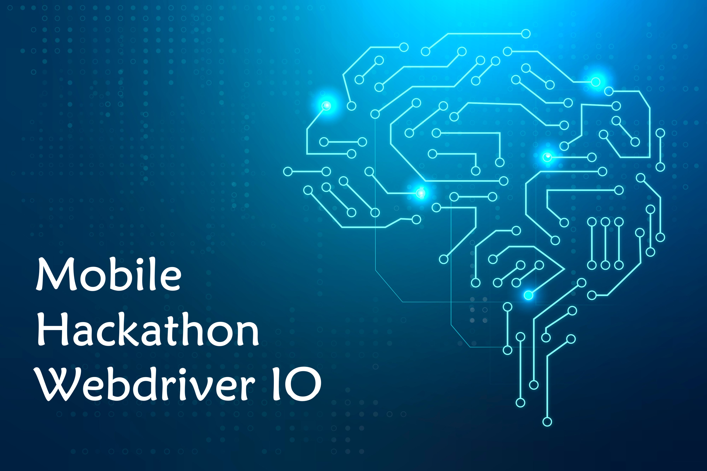
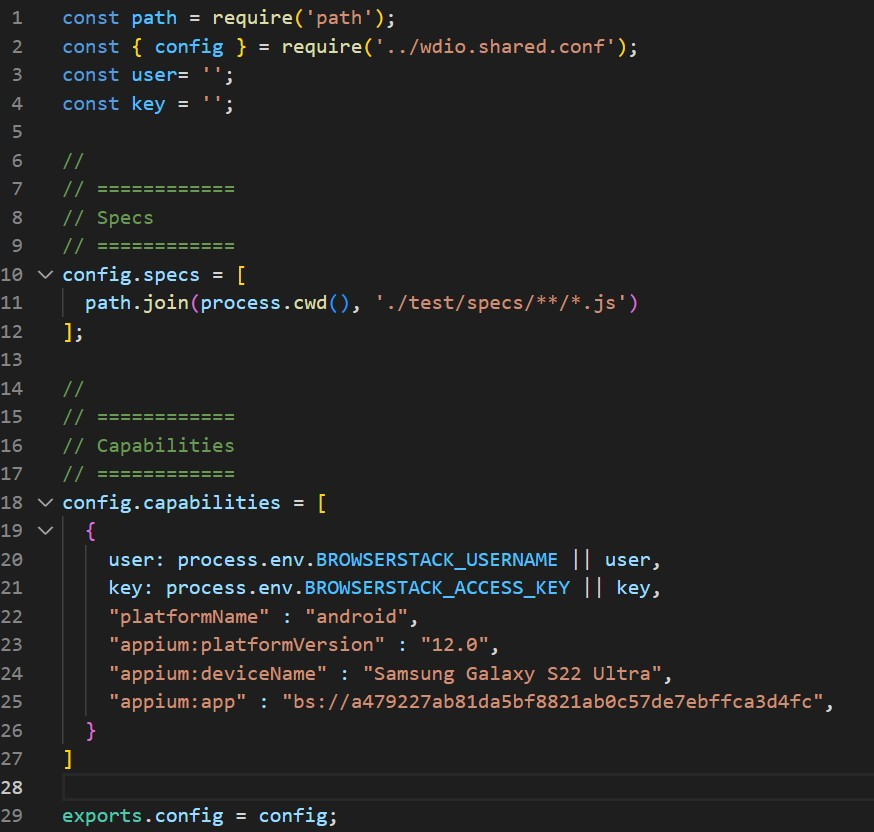
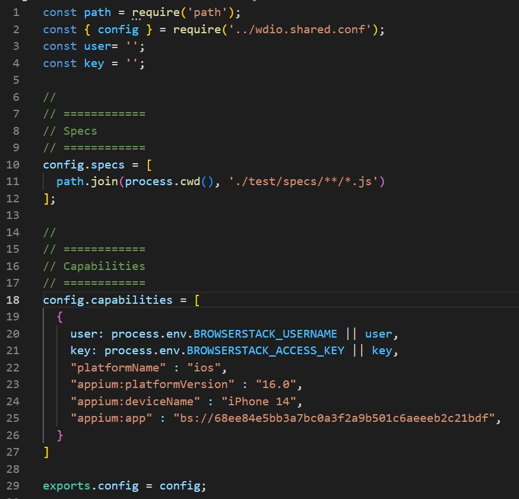
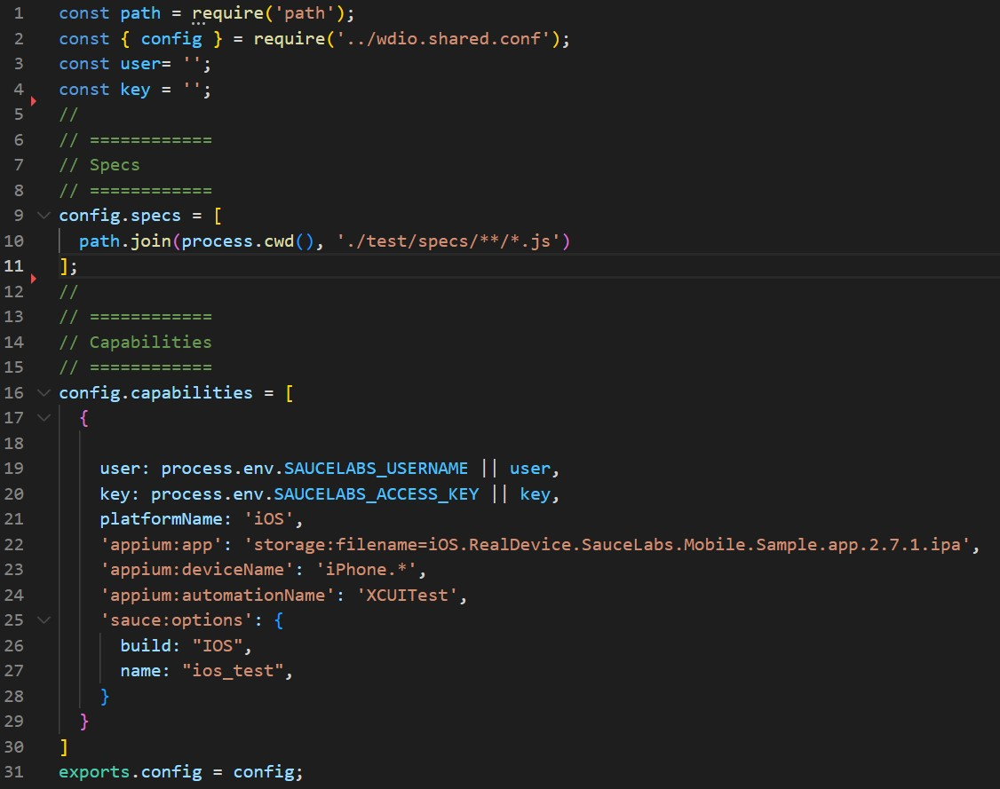
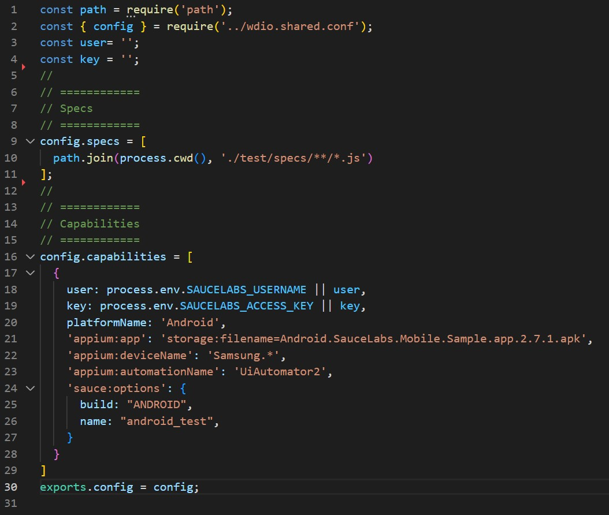
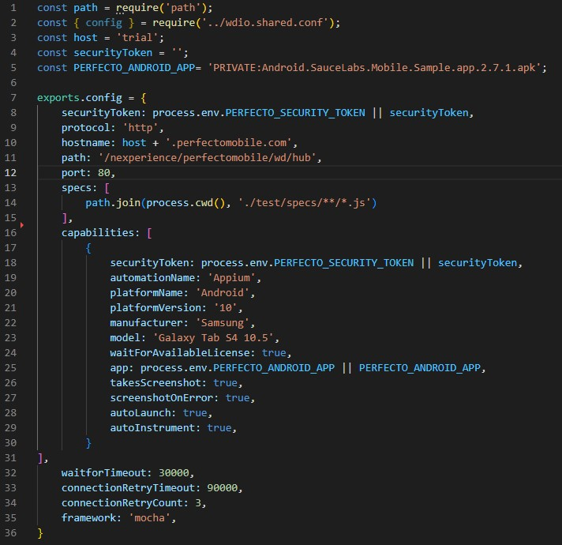

# Mobile Hackathon: Introduction
This repository is setup as a part of Mobile Test automation hackathon to demonstrate the capabilities of [WebDriverIO](https://webdriver.io/) test automation framework. The team has setup WebDriverIO for mobile native app test automation with libraries/tools such as- [mocha](https://mochajs.org/) framework, [Appium](https://appium.io) for mobile automation, [Allure Reporter](https://webdriver.io/docs/allure-reporter/) for robust reporting. We also demonstrated and compared the capabilities of integrating this framework with cloud execution environments such as- [BrowserStack](https://www.browserstack.com/), [Saucelabs](https://saucelabs.com/), [Perfecto](https://www.perfecto.io/) and [AWS Device Farm](https://aws.amazon.com/device-farm/).

## Table of contents
1. [Getting Started](#getting-started)
    1. [Pre-requisites](#Pre-requisites)
    1. [Supported testing types and platforms](#Supported-testing-types-and-platforms)
    1. [Installation](#Installation)
        1. [Use with Android](#use-with-android)
        1. [Use with iOS](#use-with-ios)
    1. [How to use](#how-to-use)
    1. [Integrations](#Integrations)
        1. [Saucelabs](#Saucelabs)
            1. [Positive Outlook](#Positive-outlook)
            1. [Shortcomings](#Shortcomings)
        1. [BrowserStack](#BrowserStack)
            1. [Positive Outlook](#Positive-outlook)
            1. [Shortcomings](#Shortcomings)
        1. [Perfecto](#Perfecto)
            1. [Positive Outlook](#Positive-outlook)
            1. [Shortcomings](#Shortcomings)
        1. [AWS Device Farm](#aws-device-farm)
            1. [Positive Outlook](#Positive-outlook)
            1. [Shortcomings](#Shortcomings)
1. [Running your first test](#running-your-test)
1. [Overall Summary](#overall-summary)
1. [Metrics](#Metrics)
1. [Cloud Service Providers list](#cloud-service-providers)
 
 ------------------------------------------------------------------------

## Getting Started
Once the pre-requisites steps are complete for setting up the framework and cloud provider execution environment setup, users can clone the repo and run the mentioned comments under each sections.

### Pre-requisites
The user must need below software installed in their machine for framework setup:

* [Node JS](https://nodejs.org/en/download/) - Should be V16.x or higher version
* Java (either from [Oracle](https://www.oracle.com/ca-en/java/technologies/downloads/) or [Open JDK](https://adoptium.net/)) - Version 8 or later
* [Appium Inspector](https://github.com/appium/appium-inspector/releases)
Note: Optional (to execute using emulator): [Android Studio](https://developer.android.com/studio)
    
Your machine should have below minimum configurations:

* OS: Windows 10 or later version | MacOS 10.7 or later version
* Processor: Intel i5 or later version 
* Memory: 8 GB RAM
* Hard Disk: 10 GB free space

### Supported testing types and platforms
- [x] Mobile app on Android
- [x] Mobile app on iOS
- [ ] Web app on Android
- [ ] Web app on iOS

### Installation and Local setup
Clone the repository and install the below required packages and drivers through Node JS

- **Install packages**: `npm install @wdio/cli`
- **Install driver for Android**: `appium driver install uiautomator2`
- **Install driver for iOS**: `appium driver install XCUI Test`
--------------------------------------------------------------------------------------------------
#### Use with Android
The target android application's apk is available in [app](https://github.com/mittalyash01/webdriverio-appium-team1/tree/main/app/android). This apk should be uploaded to the required Cloud automation framework provider website (after creating necessary user profiles)

#### Use with iOS
The target iOS application's apk is available in [app](https://github.com/mittalyash01/webdriverio-appium-team1/tree/main/app/ios). This apk should be uploaded to the required Cloud automation framework provider website (after creating necessary user profiles).

### How to Use
The below steps should be followed to use the scripts: <To be filled> To be filled

### Integrations
In this section we will elaborate the integration of the automation framework with various cloud execution environment/ device farm. We will showcase the capability of each combination: in depth analysis of what went good and bad, how we navigate through challenges and share some key metrics around each combination.

### BrowserStack 

[BrowserStack](https://www.browserstack.com/app-live) is a cloud web and mobile testing platform which offers the ability to test websites and mobile applications across on-demand browsers and real mobile devices. The list of supoorted devices and OS versions for Automation are listed [here](https://www.browserstack.com/list-of-browsers-and-platforms/app_automate)

To install wdio browserstack service run the command: `npm install @wdio/browserstack-service --save-dev`

As next step, below configuration files should be accessed:

For Android:

For iOS:

Note: *BROWSERSTACK_USERNAME and BROWSERSTACK_ACCESS_KEY are stored in environment variables and read from there, these can be obtained from browserstack's website for each users.*

    <Intentionally put to have space>    

| Shortcoming |  Positive outlook |
| --- | --- |
| * Not any significant issues | * Easy to integrate |
| | * Supports parallel runs |
| | * Supports wide range of devices and OS |

### Sauce labs
......

### Shortcoming 

### Positive outlook 
................

### Perfecto
----------

### Shortcoming 
1. Tests executed ok over iOS but same test failed over Android. Have to segregate validation steps as it was not synchronizing both together.
2. Timeout issue- fixed global timeouts
3. Need to check device availability every time before executing tests- since these were shared/public devices over the cloud. The device management is not present, could be better from usability POV.
4. Time to open a tunnel connection is somewhat longer which is approx~ 15 seconds

### Positive outlook 
.................

### AWS Device Farm
-------------

### Shortcoming 
................

### Positive outlook 
.....................

## Running your first test
...............................
`npx wdio {config} --spec {filename}`

## Overall Summary
...............................

## Metrics
-----------------------

| Test Automation tool stack | Device Farm | Abrupt Connection Loss/ Latencies (Device connection aren't reliable, abruptly the connections are lost during execution (Score out of 10)) | Execution Cycles (Test Case execution time) | Execution Cycles (Test Suite execution time)  | Tool Integrations (Complexity with tool integrations (Low/ Medioum/ High/ Very High) | Framework Stability (% of test cases passed as compared to total number of executions) | Android/iOS version (Tool support for android/iOS versions) | Technical Support (Insufficient support received from vendor) | Technical Support (Native app or list the features not supported by the tool) |
| --- | --- | --- | --- | --- | --- | --- | --- | --- |--- |
| Appium + WebDriverIO | BrowserStack |  |  |  |  |  |  | |  |
| Appium + WebDriverIO | Perfecto |  |  |  |  |  |  |  |  |
| Appium + WebDriverIO | Saucelabs |  |  |  |  |  |  |  |  |
| Appium + WebDriverIO | AWS Device Farm |  |  |  |  |  |  |  |  |

## Cloud Service Providers list

<a href="https://www.browserstack.com/">
<a href="https://saucelabs.com/">
<a href="https://www.perfecto.io//">
<a href="https://aws.amazon.com/device-farm/">

